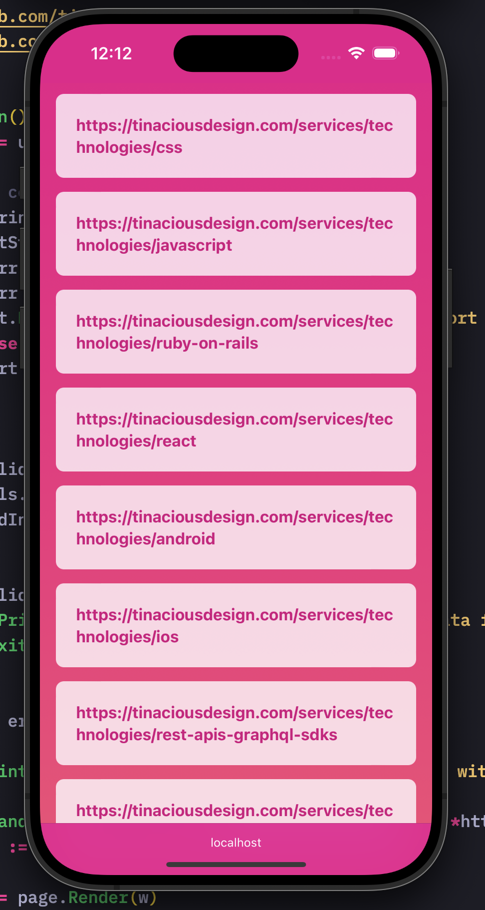
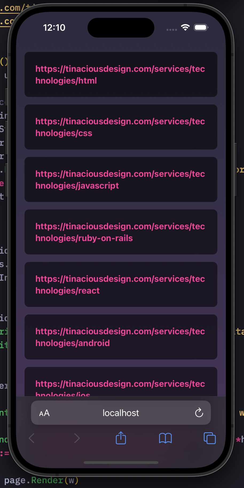

# link-server

`link-server` is a simple command line app written in Go that serves each line of a text file as a collection of links

- [Features](#features)
- [Installation](#installation)
  - [Install using Go](#install-using-go)
  - [Install manually](#install-manually)
- [Usage](#usage)
  - [Links from file](#links-from-file)
  - [Links from data piped from standard input](#links-from-data-piped-from-standard-input)
  - [Custom port](#custom-port)
- [Uninstall](#uninstall)


## Features

- No external dependencies are used. The project leverages native Go packages only.
- No external runtime dependencies. Some CLI tools require you to have a specific version of Node.js, Python or another language, this does not.
- Multi-platform: Thanks to Go, this works on macOS, Windows and Linux

<table>
<tr>
  <td></td>
  <td></td>
</tr>
</table>


## Installation

### Install using Go

If you have Go lang tooling installed, this is the way that is recommended since it will build the binary for your architecture and make it executable.

Install the CLI tool using `go install`:

```sh
go install github.com/tinacious/link-server@latest
```

### Install manually

Go to the [releases](https://github.com/tinacious/link-server/releases) page and download the appropriate release for your operating system and architecture.

Put the file somewhere on your executables path, e.g. I use `~/.local/bin`.

On macOS, you will need to trust the executable after the first run attempt in your **System Preferences &rarr; Privacy & Security** settings.


## Usage

### Links from file

Run the `link-server` command with the path of the file with links on each line as the first and only argument:

```sh
cd test
link-server my-deep-links.txt
```

This should serve the links on a random port.


### Links from data piped from standard input

You can also pipe links to `link-server`, one link on each line. Here's an example that fetches links from an API endpoint and then pipes it to `link-server`:

```sh
curl -s https://tinaciousdesign.com/api/technologies |
  jq -r '"https://tinaciousdesign.com/services/technologies/" + .data[].slug' |
  PORT=8621 link-server
```


### Custom port

You can configure the port by passing it as an environment variable. For example, to run on port 1337 run:

```sh
PORT=1337 link-server my-deep-links.txt
```


## Uninstall

To uninstall it, simply delete the executable `link-server`.

If you installed it with Go, you can navigate to either `$GOPATH/bin` (if your `$GOPATH` is defined) or  `~/go/bin` and delete it from there.

If you installed it manually, e.g. in `~/.local/bin`, delete it from there.
